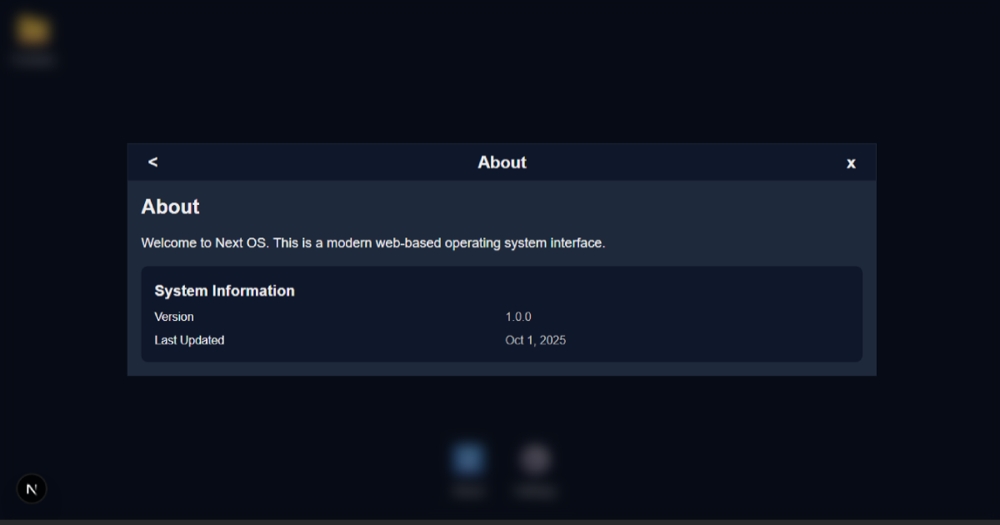

# Next.js OS Template

A modern, desktop-inspired operating system interface built with Next.js, React, and Tailwind CSS. 

View demo: https://nextos.vercel.app/

## 📸 Screenshots

<div align="center">
  
  <br><br>
  
  <br>
  <em>Desktop (top) and mobile (bottom) views of the OS interface</em>
</div>

## Features

- Icon-based app launcher with OS-inspired interface
- Responsive design with single-window interface
- Optimized performance with React.memo and useCallback
- Easy to use
- Minimalistic starter with example content
- Cleanup script to start fresh

## Getting Started

### 🚀 Quick Start

#### 1-Click Deploy on Vercel
[](https://vercel.com/new/clone?repository-url=https:%2F%2Fgithub.com%2FJohan%2DMelin%2Fnext%2Dos.git)

### Local Development

1. **Use this template**
   - Click the "Use this template" button above
   - Or clone the repository:
   ```bash
   git clone https://github.com/Johan-Melin/next-os.git
   cd next-os
   ```

2. **Install dependencies**
   ```bash
   npm install
   # or
   yarn
   # or
   pnpm install
   ```

3. **Run the development server**
   ```bash
   npm run dev
   # or
   yarn dev
   # or
   pnpm dev
   ```

4. Open [http://localhost:3000](http://localhost:3000) in your browser

5. **Remove default content**
   ```bash
   npm run clean
   # or
   yarn clean
   # or
   pnpm clean
   ```

## Customization

### Adding New Windows
1. Create a new component
2. Add the component to `contentMapping.ts`
3. Update the desktop configuration in `config/desktop.ts`

## License

This project is licensed under the MIT License - see the [LICENSE](https://mit-license.org/) file for details.


